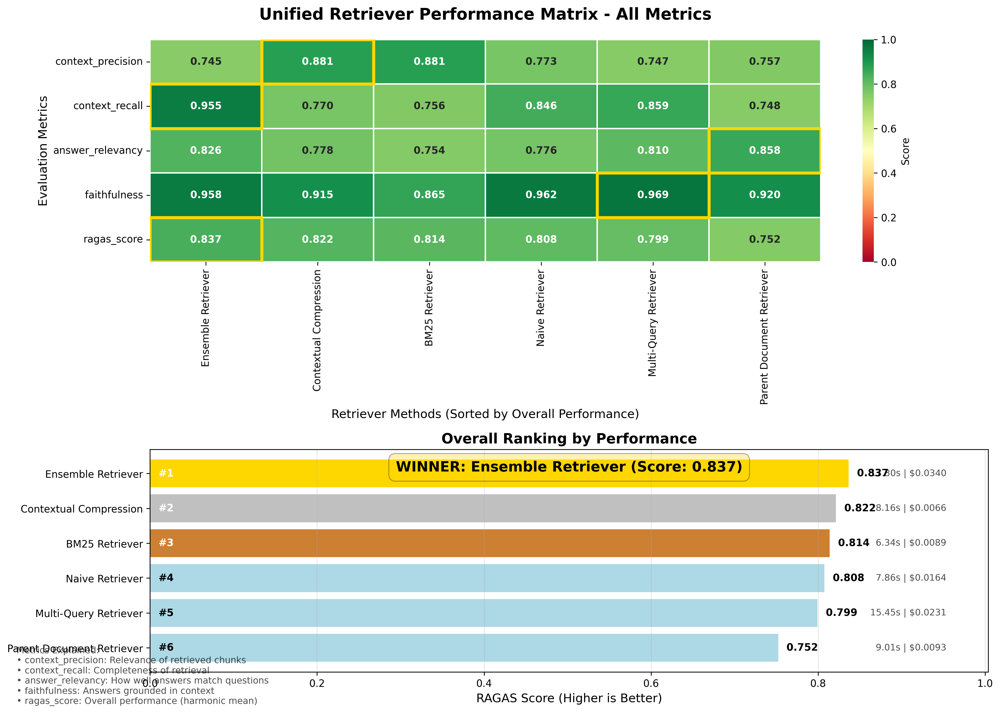

# Retriever Evaluation Results Analysis

## Executive Summary

The evaluation of six retriever methods on loan complaint data using RAGAS metrics revealed that **Ensemble Retriever** achieved the highest performance with a RAGAS score of 0.837, demonstrating that hybrid approaches excel for structured financial data.

## Performance Rankings

### Overall RAGAS Scores

| Rank | Retriever | RAGAS Score | Performance Bar |
|------|-----------|-------------|-----------------|
| 🥇 1st | **Ensemble Retriever** | **0.837** | ████████████████████████████████████████ |
| 🥈 2nd | Contextual Compression | 0.822 | ████████████████████████████████████████ |
| 🥉 3rd | BM25 Retriever | 0.814 | ███████████████████████████████████████ |
| 4th | Naive Retriever | 0.808 | ███████████████████████████████████████ |
| 5th | Multi-Query Retriever | 0.799 | ██████████████████████████████████████ |
| 6th | Parent Document Retriever | 0.752 | ████████████████████████████████████ |

## Key Performance Metrics

### Retrieval Quality Metrics

| Retriever | Context Precision | Context Recall | Answer Relevancy | Faithfulness |
|-----------|-------------------|----------------|------------------|--------------|
| Ensemble Retriever | 0.7446 | **0.9546** | 0.8258 | 0.9577 |
| Contextual Compression | **0.8810** | 0.7696 | 0.7785 | 0.9154 |
| BM25 Retriever | **0.8810** | 0.7563 | 0.7539 | 0.8652 |
| Naive Retriever | 0.7728 | 0.8459 | 0.7759 | 0.9618 |
| Multi-Query Retriever | 0.7469 | 0.8594 | 0.8103 | **0.9691** |
| Parent Document Retriever | 0.7566 | 0.7480 | **0.8581** | 0.9198 |

### Operational Performance Metrics

| Retriever | Avg Latency (s/query) | Total Cost (USD) | Score/Dollar | Score/Second |
|-----------|-----------------------|------------------|--------------|--------------|
| Ensemble Retriever | 17.30 | $0.0340 | 24.53 | 0.048 |
| Contextual Compression | 8.16 | **$0.0066** | **122.61** | 0.101 |
| BM25 Retriever | **6.34** | $0.0089 | 90.43 | **0.128** |
| Naive Retriever | 7.86 | $0.0164 | 48.95 | 0.103 |
| Multi-Query Retriever | 15.45 | $0.0231 | 34.45 | 0.052 |
| Parent Document Retriever | 9.01 | $0.0093 | 80.03 | 0.084 |

### Summary Statistics
- **Test Dataset**: 21 synthetic queries generated by RAGAS
- **Evaluation Data**: Loan complaint CSV documents only
- **Best Overall**: Ensemble Retriever (RAGAS Score: 0.837)
- **Most Efficient**: Contextual Compression (122.61 score/dollar)

## Key Insights

### Why Ensemble Retriever Won
Despite having the lowest context precision (0.7446), Ensemble Retriever's exceptional recall (0.9546) captured nearly all relevant information by combining:
- BM25's keyword matching for exact financial terms
- Semantic search for conceptual understanding

### Performance Trade-offs
1. **Speed vs Accuracy**: BM25 offers fastest retrieval but misses 24% of relevant content
2. **Cost vs Performance**: Contextual Compression provides best value at $0.0066/run
3. **Precision vs Recall**: High-precision methods (BM25, Contextual) sacrifice recall

### Understanding Cost-Efficiency Metrics
The **score/dollar** metric shows performance per dollar spent. For example, Contextual Compression's 122.61 score/dollar means:
- For every $1 spent, you get 122.61 units of RAGAS score performance
- Calculated as: RAGAS Score (0.8215) ÷ Cost ($0.0066) = 122.61

**Cost-efficiency comparison**:
- **Contextual Compression**: 122.61 score/dollar - achieves 98% of winner's performance at 19% of cost
- **BM25 Retriever**: 90.43 score/dollar - good balance of cost and performance
- **Ensemble Retriever**: 24.53 score/dollar - best performance but most expensive

This makes Contextual Compression ideal for budget-conscious deployments requiring good performance without high costs.

### Surprising Findings
- **Parent Document Retriever** significantly underperformed (0.7523), indicating hierarchical chunking is counterproductive for already-atomic complaint documents
- **Multi-Query Retriever** showed highest faithfulness (0.9691) but with prohibitive latency (15.45s/query)

## Deployment Recommendations

### Use Case Scenarios
- **Production/Compliance**: Ensemble Retriever (highest accuracy)
- **High-Volume Processing**: BM25 Retriever (fastest, good precision)
- **Budget-Conscious**: Contextual Compression (best cost-effectiveness)
- **Research/Analysis**: Multi-Query Retriever (most thorough)

### Technical Considerations
- Ensemble approach requires both keyword and vector indices
- Contextual Compression needs Cohere API access
- Parent Document adds unnecessary complexity for CSV data
- Multi-Query increases costs due to multiple LLM calls

## Visualizations

### Unified Performance Overview

### Detailed Performance Analysis

## At Scale

Cost Analysis Insight:

The 5x cost difference between solutions becomes critical at scale. Processing 1 million queries would cost:

- Ensemble: $1,619

- Contextual Compression: $314

- BM25: $424

This $1,300 difference per million queries makes Contextual Compression attractive for large-scale deployments where lower accuracy is acceptable.

Final Takeaway:

The best retrieval system isn't necessarily the most advanced or the highest-scoring on individual metrics. It's the one that balances performance, cost, and speed for your specific use case. For structured financial data, simple hybrid approaches provide the optimal balance.